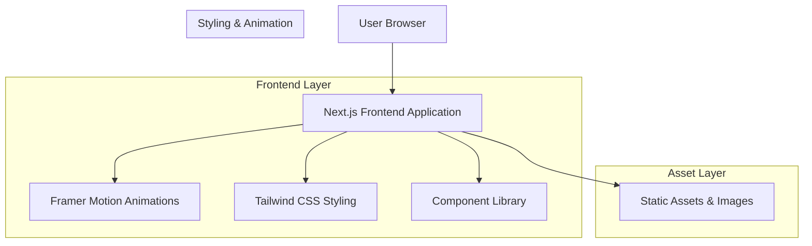

# Website Design Improvement - Technical Architecture Document

## 1. Architecture Design



## 2. Technology Description

* Frontend: Next.js\@14 + React\@18 + TypeScript + Tailwind CSS\@3 + Framer Motion\@11

* UI Components: Radix UI + Lucide React icons

* Image Optimization: Next.js Image component

* Deployment: Vercel (recommended)

## 3. Route Definitions

| Route             | Purpose                                                               |
| ----------------- | --------------------------------------------------------------------- |
| /                 | Enhanced home page with improved hero, about, and experience sections |
| /projects         | Redesigned projects showcase with advanced filtering and search       |
| /products         | Premium products page with enhanced cards and pricing display         |
| /articles         | Modern blog layout with improved typography and navigation            |
| /articles/\[slug] | Individual article pages with optimized reading experience            |
| /business         | Business insights and entrepreneurship content                        |
| /tools            | Development tools and resources showcase                              |
| /videos           | Video content gallery with improved layout                            |
| /newsletter       | Newsletter subscription and archive                                   |
| /book-notes       | Reading insights and book summaries                                   |

## 4. Component Architecture

### 4.1 Design System Components

**Enhanced UI Components:**

```typescript
// Premium Card Component
interface PremiumCardProps {
  children: React.ReactNode
  className?: string
  hover?: boolean
  glassmorphism?: boolean
}

// Enhanced Button Component
interface EnhancedButtonProps {
  variant: 'primary' | 'secondary' | 'ghost' | 'outline'
  size: 'sm' | 'md' | 'lg'
  gradient?: boolean
  icon?: React.ReactNode
}

// Animated Section Component
interface AnimatedSectionProps {
  children: React.ReactNode
  animation: 'fadeIn' | 'slideUp' | 'slideLeft' | 'slideRight'
  delay?: number
}
```

### 4.2 Page-Specific Components

**Home Page Components:**

* EnhancedHero: Improved hero section with glassmorphism and animations

* RefinedAboutSection: Better layout and visual hierarchy

* ModernExperienceTimeline: Enhanced timeline design

* SkillsShowcase: New component for technical skills

* TestimonialsCarousel: Client testimonials with smooth transitions

**Projects Page Components:**

* AdvancedProjectFilter: Enhanced filtering with animations

* ProjectCard: Redesigned project cards with hover effects

* ProjectSearch: Improved search functionality

* ProjectStats: Statistics display with animated counters

**Products Page Components:**

* ProductShowcase: Premium product cards with pricing

* FeatureList: Enhanced feature display with icons

* PricingBadge: Status and pricing indicators

* ProductComparison: Side-by-side product comparison

**Articles Page Components:**

* ModernBlogGrid: Improved blog post layout

* ArticleCard: Enhanced article preview cards

* CategoryFilter: Article category filtering

* ReadingProgress: Progress indicator for articles

## 5. Styling Architecture

### 5.1 Tailwind CSS Configuration

```javascript
// Enhanced tailwind.config.js
module.exports = {
  content: ['./app/**/*.{js,ts,jsx,tsx}', './components/**/*.{js,ts,jsx,tsx}'],
  theme: {
    extend: {
      colors: {
        primary: {
          50: '#fffbeb',
          100: '#fef3c7',
          200: '#fde68a',
          300: '#fcd34d',
          400: '#fbbf24',
          500: '#f59e0b',
          600: '#d97706',
          700: '#b45309',
          800: '#92400e',
          900: '#78350f'
        },
        accent: {
          50: '#fff7ed',
          100: '#ffedd5',
          200: '#fed7aa',
          300: '#fdba74',
          400: '#fb923c',
          500: '#f97316',
          600: '#ea580c',
          700: '#c2410c',
          800: '#9a3412',
          900: '#7c2d12'
        }
      },
      fontFamily: {
        sans: ['Inter', 'system-ui', 'sans-serif'],
        mono: ['JetBrains Mono', 'monospace']
      },
      animation: {
        'fade-in': 'fadeIn 0.6s ease-out',
        'slide-up': 'slideUp 0.6s ease-out',
        'float': 'float 6s ease-in-out infinite',
        'glow': 'glow 2s ease-in-out infinite alternate'
      },
      backdropBlur: {
        xs: '2px'
      },
      boxShadow: {
        'premium': '0 25px 50px rgba(0, 0, 0, 0.15)',
        'glow': '0 0 20px rgba(251, 191, 36, 0.3)'
      }
    }
  },
  plugins: [
    require('@tailwindcss/typography'),
    require('@tailwindcss/forms')
  ]
}
```

### 5.2 Custom CSS Utilities

```css
/* Enhanced global styles */
@layer utilities {
  .glassmorphism {
    background: rgba(255, 255, 255, 0.25);
    backdrop-filter: blur(10px);
    border: 1px solid rgba(255, 255, 255, 0.18);
  }
  
  .premium-gradient {
    background: linear-gradient(135deg, #fbbf24 0%, #f97316 100%);
  }
  
  .text-gradient {
    background: linear-gradient(135deg, #fbbf24 0%, #f97316 100%);
    -webkit-background-clip: text;
    -webkit-text-fill-color: transparent;
    background-clip: text;
  }
  
  .hover-lift {
    transition: all 0.3s cubic-bezier(0.4, 0, 0.2, 1);
  }
  
  .hover-lift:hover {
    transform: translateY(-8px);
  }
  
  .premium-card {
    background: linear-gradient(145deg, rgba(255, 255, 255, 0.9), rgba(255, 255, 255, 0.7));
    backdrop-filter: blur(20px);
    border: 1px solid rgba(251, 191, 36, 0.2);
    box-shadow: 0 20px 40px rgba(0, 0, 0, 0.1);
  }
}
```

## 6. Animation System

### 6.1 Framer Motion Configuration

```typescript
// Animation variants for consistent motion
export const fadeInUp = {
  initial: { opacity: 0, y: 30 },
  animate: { opacity: 1, y: 0 },
  transition: { duration: 0.6, ease: 'easeOut' }
}

export const staggerContainer = {
  animate: {
    transition: {
      staggerChildren: 0.1
    }
  }
}

export const slideInLeft = {
  initial: { opacity: 0, x: -50 },
  animate: { opacity: 1, x: 0 },
  transition: { duration: 0.8, ease: 'easeOut' }
}

export const scaleOnHover = {
  whileHover: { scale: 1.05 },
  whileTap: { scale: 0.95 },
  transition: { duration: 0.2 }
}
```

### 6.2 Performance Optimizations

* Use `will-change` CSS property for animated elements

* Implement `useReducedMotion` hook for accessibility

* Lazy load animations with Intersection Observer

* Optimize animation performance with `transform` and `opacity`

## 7. Image Optimization Strategy

### 7.1 Next.js Image Component Usage

```typescript
// Optimized image component
interface OptimizedImageProps {
  src: string
  alt: string
  width: number
  height: number
  priority?: boolean
  className?: string
}

const OptimizedImage: React.FC<OptimizedImageProps> = ({
  src,
  alt,
  width,
  height,
  priority = false,
  className
}) => {
  return (
    <Image
      src={src}
      alt={alt}
      width={width}
      height={height}
      priority={priority}
      className={className}
      sizes="(max-width: 768px) 100vw, (max-width: 1200px) 50vw, 33vw"
      quality={85}
      placeholder="blur"
      blurDataURL="data:image/jpeg;base64,/9j/4AAQSkZJRgABAQAAAQABAAD/2wBDAAYEBQYFBAYGBQYHBwYIChAKCgkJChQODwwQFxQYGBcUFhYaHSUfGhsjHBYWICwgIyYnKSopGR8tMC0oMCUoKSj/2wBDAQcHBwoIChMKChMoGhYaKCgoKCgoKCgoKCgoKCgoKCgoKCgoKCgoKCgoKCgoKCgoKCgoKCgoKCgoKCgoKCgoKCj/wAARCAABAAEDASIAAhEBAxEB/8QAFQABAQAAAAAAAAAAAAAAAAAAAAv/xAAUEAEAAAAAAAAAAAAAAAAAAAAA/8QAFQEBAQAAAAAAAAAAAAAAAAAAAAX/xAAUEQEAAAAAAAAAAAAAAAAAAAAA/9oADAMBAAIRAxEAPwCdABmX/9k="
    />
  )
}
```

### 7.2 Image Formats and Sizes

* Use WebP format with JPEG fallback

* Implement responsive images with multiple sizes

* Optimize for different screen densities (1x, 2x, 3x)

* Lazy load images below the fold

## 8. Responsive Design Implementation

### 8.1 Breakpoint Strategy

```typescript
// Responsive breakpoints
const breakpoints = {
  sm: '640px',
  md: '768px',
  lg: '1024px',
  xl: '1280px',
  '2xl': '1536px'
}

// Custom hook for responsive behavior
const useResponsive = () => {
  const [screenSize, setScreenSize] = useState('lg')
  
  useEffect(() => {
    const handleResize = () => {
      const width = window.innerWidth
      if (width < 640) setScreenSize('sm')
      else if (width < 768) setScreenSize('md')
      else if (width < 1024) setScreenSize('lg')
      else setScreenSize('xl')
    }
    
    handleResize()
    window.addEventListener('resize', handleResize)
    return () => window.removeEventListener('resize', handleResize)
  }, [])
  
  return screenSize
}
```

### 8.2 Mobile-First Approach

* Design components for mobile first

* Progressive enhancement for larger screens

* Touch-friendly interactive elements

* Optimized navigation for mobile devices

## 9. Performance Monitoring

### 9.1 Core Web Vitals

* Largest Contentful Paint (LCP): < 2.5s

* First Input Delay (FID): < 100ms

* Cumulative Layout Shift (CLS): < 0.1

### 9.2 Optimization Techniques

* Code splitting with dynamic imports

* Bundle analysis and optimization

* Critical CSS inlining

* Resource preloading for above-the-fold content

* Service worker for caching strategies

## 10. Accessibility Implementation

### 10.1 WCAG 2.1 AA Compliance

* Color contrast ratios: 4.5:1 for normal text, 3:1 for large text

* Keyboard navigation support

* Screen reader optimization

* Focus management

* Alternative text for images

* Semantic HTML structure

### 10.2 Accessibility Testing

* Automated testing with axe-core

* Manual testing with screen readers

* Keyboard navigation testing

* Color blindness simulation

* Mobile accessibility testing

## 11. Development Workflow

### 11.1 Component Development

1. Create component with TypeScript interfaces
2. Implement responsive design
3. Add animations with Framer Motion
4. Test accessibility compliance
5. Optimize performance
6. Document component usage

### 11.2 Quality Assurance

* ESLint and Prettier for code formatting

* TypeScript for type safety

* Lighthouse audits for performance

* Cross-browser testing

* Mobile device testing

## 12. Deployment Strategy

### 12.1 Vercel Deployment

* Automatic deployments from Git

* Preview deployments for pull requests

* Edge functions for dynamic content

* Image optimization with Vercel

* Analytics and performance monitoring

### 12.2 Environment Configuration

```javascript
// next.config.js
module.exports = {
  images: {
    domains: ['example.com'],
    formats: ['image/webp', 'image/avif']
  },
  experimental: {
    optimizeCss: true
  },
  compiler: {
    removeConsole: process.env.NODE_ENV === 'production
```

