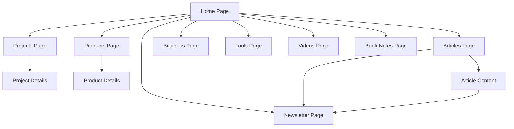

# Website Design Improvement - Product Requirements Document

## 1. Product Overview

This document outlines comprehensive design improvements for Mostafijur Rahman's personal website, transforming it into a premium, professional platform that showcases his expertise as an entrepreneur and software engineer. The improvements focus on creating a cohesive design system, enhancing user experience, and establishing visual hierarchy that reflects modern web standards while maintaining the entrepreneurial spirit.

## 2. Core Features

### 2.1 User Roles

| Role                  | Registration Method      | Core Permissions                                                  |
| --------------------- | ------------------------ | ----------------------------------------------------------------- |
| Visitor               | No registration required | Can browse all content, read articles, view projects and products |
| Newsletter Subscriber | Email subscription       | Receives weekly updates and exclusive content                     |

### 2.2 Feature Module

Our website improvement consists of the following main pages:

1. **Home page**: Enhanced hero section, refined about section, improved experience timeline, skills showcase, testimonials
2. **Projects page**: Advanced filtering system, improved project cards, better visual hierarchy
3. **Products page**: Product showcase with enhanced cards, pricing display, feature highlights
4. **Articles page**: Modern blog layout, improved typography, better content organization
5. **Business page**: Entrepreneurship insights and business content
6. **Tools page**: Development tools and resources
7. **Videos page**: Video content showcase
8. **Newsletter page**: Subscription management and archive
9. **Book Notes page**: Reading insights and summaries

### 2.3 Page Details

| Page Name       | Module Name          | Feature description                                                                                                                             |
| --------------- | -------------------- | ----------------------------------------------------------------------------------------------------------------------------------------------- |
| Home page       | Hero section         | Implement glassmorphism effects, improved typography hierarchy, animated elements with better performance, professional profile image treatment |
| Home page       | About section        | Enhanced content layout, better visual balance, improved call-to-action buttons, refined achievement metrics display                            |
| Home page       | Experience timeline  | Modern timeline design, improved card layouts, better spacing and typography                                                                    |
| Projects page   | Project showcase     | Advanced filtering with smooth animations, improved project cards with hover effects, better image optimization                                 |
| Projects page   | Search & Filter      | Enhanced search functionality, category filters with visual indicators, sorting options                                                         |
| Products page   | Product cards        | Premium card design with pricing, features list, status indicators, improved imagery                                                            |
| Products page   | Product details      | Comprehensive product information, feature highlights, user testimonials                                                                        |
| Articles page   | Blog layout          | Modern grid layout, improved typography, better content preview, enhanced navigation                                                            |
| Articles page   | Article content      | Optimized reading experience, better code syntax highlighting, improved media handling                                                          |
| Business page   | Content organization | Professional layout for business insights, improved content structure                                                                           |
| Tools page      | Tools showcase       | Organized tool categories, improved descriptions, better visual presentation                                                                    |
| Videos page     | Video gallery        | Responsive video grid, improved thumbnails, better metadata display                                                                             |
| Newsletter page | Subscription form    | Enhanced form design, better user feedback, improved success states                                                                             |
| Book Notes page | Notes organization   | Improved content structure, better reading experience, enhanced navigation                                                                      |

## 3. Core Process

### User Journey Flow

Visitors typically follow this navigation pattern:

1. Land on homepage → View hero and about sections → Explore projects/products
2. Browse projects → Filter by technology/category → View project details
3. Explore products → Learn about features → Consider subscription/purchase
4. Read articles → Browse by category → Subscribe to newsletter
5. Access additional resources → Tools, videos, business insights

## 4. User Interface Design

### 4.1 Design Style

**Color Palette:**

* Primary: Warm gradient from #fbbf24 (yellow-400) to #f97316 (orange-500)

* Secondary: #fde047 (yellow-300) to #fb923c (orange-400)

* Accent: #facc15 (yellow-400) to #ea580c (orange-600)

* Neutral: #1f2937 (gray-800), #6b7280 (gray-500), #f9fafb (gray-50)

* Background: Subtle gradients from #fffbeb to #fef3c7 to #fed7aa

**Typography:**

* Primary font: Inter (400, 500, 600, 700, 800)

* Heading font: Inter with tighter tracking

* Code font: JetBrains Mono

* Font sizes: 12px, 14px, 16px, 18px, 20px, 24px, 32px, 48px, 64px

**Button Styles:**

* Primary: Gradient background with rounded corners (12px radius)

* Secondary: Outline style with gradient border

* Ghost: Transparent with hover effects

* All buttons include subtle shadows and hover animations

**Layout Style:**

* Card-based design with glassmorphism effects

* Generous white space and consistent spacing (8px grid system)

* Top navigation with sticky behavior

* Responsive grid layouts

* Smooth scroll animations and micro-interactions

**Icons and Animations:**

* Lucide React icons for consistency

* Framer Motion for smooth animations

* Subtle hover effects and state transitions

* Loading states and skeleton screens

### 4.2 Page Design Overview

| Page Name     | Module Name         | UI Elements                                                                                                                                                       |
| ------------- | ------------------- | ----------------------------------------------------------------------------------------------------------------------------------------------------------------- |
| Home page     | Hero section        | Glassmorphism card overlay, animated gradient backgrounds, floating elements, improved profile image with border effects, enhanced social links with hover states |
| Home page     | About section       | Two-column layout with improved spacing, enhanced achievement cards with icons, better call-to-action button styling, refined typography hierarchy                |
| Home page     | Experience timeline | Vertical timeline with improved connectors, enhanced company logos, better content organization, smooth scroll animations                                         |
| Projects page | Header              | Large typography with gradient text effects, animated statistics cards, improved search bar with glassmorphism                                                    |
| Projects page | Project grid        | Enhanced cards with hover effects, improved image handling, better technology tag styling, smooth filtering animations                                            |
| Products page | Product showcase    | Premium card design with pricing badges, feature lists with checkmarks, status indicators, improved call-to-action buttons                                        |
| Articles page | Blog grid           | Modern card layout with improved typography, better image aspect ratios, enhanced category tags, smooth hover transitions                                         |
| Navigation    | Navbar              | Glassmorphism effect with backdrop blur, improved logo design, enhanced dropdown menus, better mobile navigation                                                  |
| Global        | Footer              | Improved layout with better organization, enhanced social links, consistent styling with overall theme                                                            |

### 4.3 Responsiveness

The website follows a mobile-first approach with breakpoints at:

* Mobile: 320px - 768px

* Tablet: 768px - 1024px

* Desktop: 1024px+

Key responsive features:

* Fluid typography scaling

* Adaptive grid layouts

* Touch-optimized interactions

* Optimized images for different screen densities

* Consistent spacing across all devices

### 4.4 Performance Optimizations

* Lazy loading for images and components

* Optimized animations with reduced motion preferences

* Efficient bundle splitting

* Image optimization with Next.js Image component

* Minimal JavaScript for critical rendering path

### 4.5 Accessibility Features

* WCAG 2.1 AA compliance

* Proper color contrast ratios

* Keyboard navigation support

* Screen reader optimization

* Focus management for interactive elements

* Alternative text for all images

### 4.6 Design System Components

**Cards:**

* Premium cards with glassmorphism effects

* Consistent padding and border radius

* Subtle shadows and hover states

* Responsive behavior

**Forms:**

* Consistent input styling

* Clear validation states

* Accessible labels and error messages

* Smooth focus transitions

**Navigation:**

* Sticky header with backdrop blur

* Smooth scroll behavior

* Active state indicators

* Mobile-optimized menu

**Content:**

* Consistent typography scale

* Proper heading hierarchy

* Optimized line heights and spacing

* Enhanced code block styling

